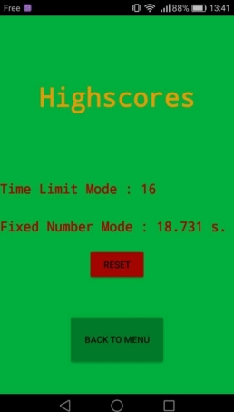

# SHAKE 15

Shake15 is a small android game I made in my spare time. The aim is to shake your phone in the directions given on your screen. You have to be quick and reactive !

## Features

- Two gamemodes :
  - **Fixed number**, where you have to score 15 points as quickly as possible
  - **Time limit**, where you have 15 seconds to score as many points as possible
- Highscores management

## Screenshots

Welcome screen :  

In game screen :

Highscores screen :

